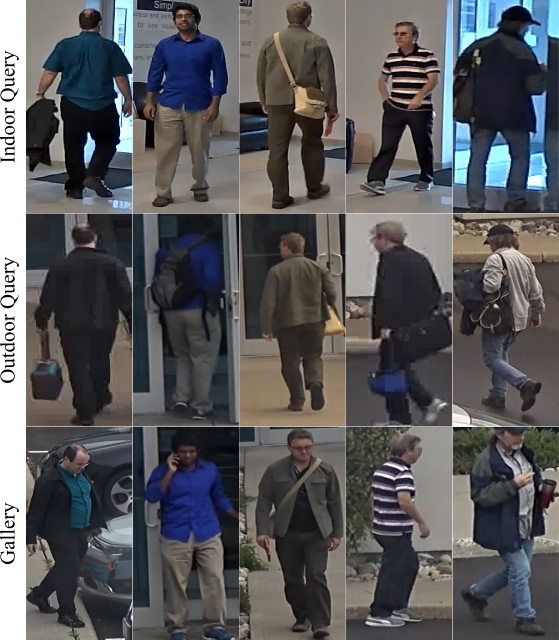

# OfficeBuildingREIDDataset
REID dataset used in [1]:

> The OfficeBuilding dataset contains two camera views (an outdoor and indoor view) of people entering and leaving a building during a single workday. Images from the outdoor camera are used for the gallery and the within-camera query. To ensure the within-camera query and the gallery do not have frames of an individual from the same time, we take all frames from a person entering the building for the first time (typically early morning) as the within-camera query image. People exiting the building and anyone seen re-entering the building on the outdoor camera are used as part of the gallery. All individuals seen in the indoor camera view are used for the across-camera view query image. Figure 3 shows sample images from the OfficeBuilding dataset. 

When using this dataset please cite:

> [1] P. Marchwica, M. Jamieson, and P. Siva. An Evaluation of Deep CNN Baselines for Scene-Independent Person Re-Identification. Proceedings of the Canadian Conference on Computer and Robot Vision (CRV), Toronto, 2018.

## Data Format

OfficeBuilding.zip contains three folders:
* GalleryOutdoor: contains the images used for the gallery. All images are from the outdoor camera.
* ProbeIndoor: probe (query) images from the indoor camera
* ProbeOutdoor: probe (query) images from the outdoor camera. There are no overlap between these images and images in GalleryOutdoor

The filenames of the images are of the format PersonID_Time_FrameNUM.png
* ID: unique person ID for each unique individuals in the dataset 
* Time: time the person was captured on camera
* NUM: frame number in the video

Please note that for each individual tracks up to 20 frames were uniformly sampled from the track. This is the reason why Frame numbers are not in consecutive order for all individuals.

Person detections were obtained using the [ACF detector](https://pdollar.github.io/toolbox/) then manually filtered to avoid false detections and poor detections.